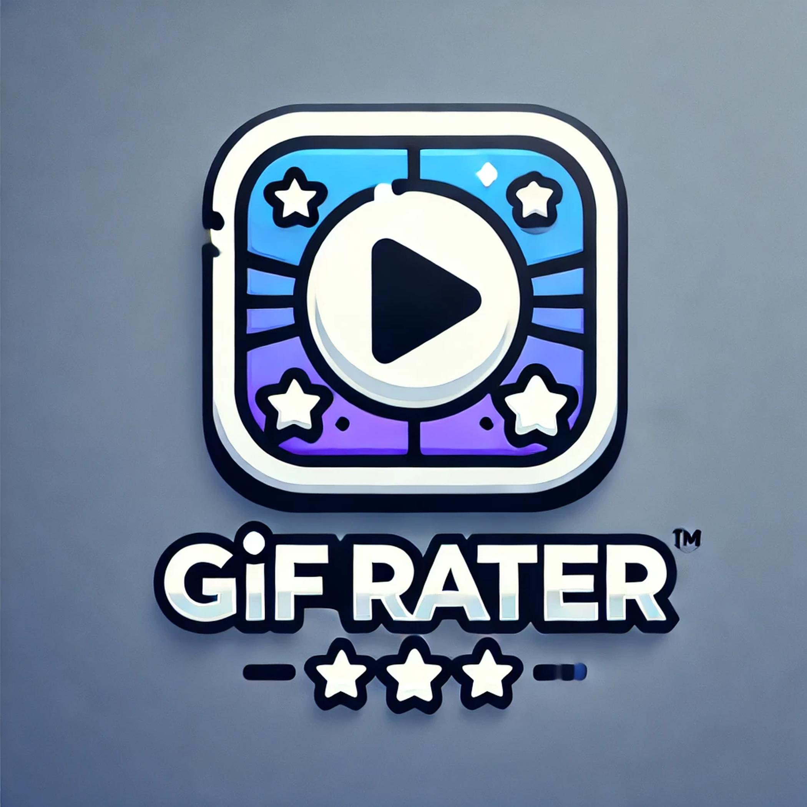
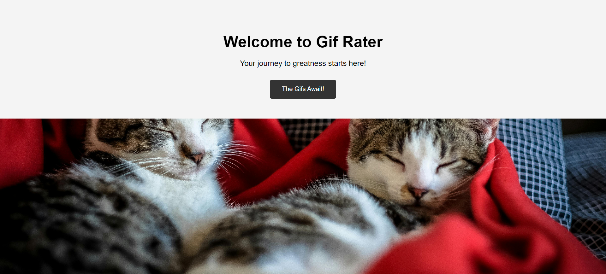
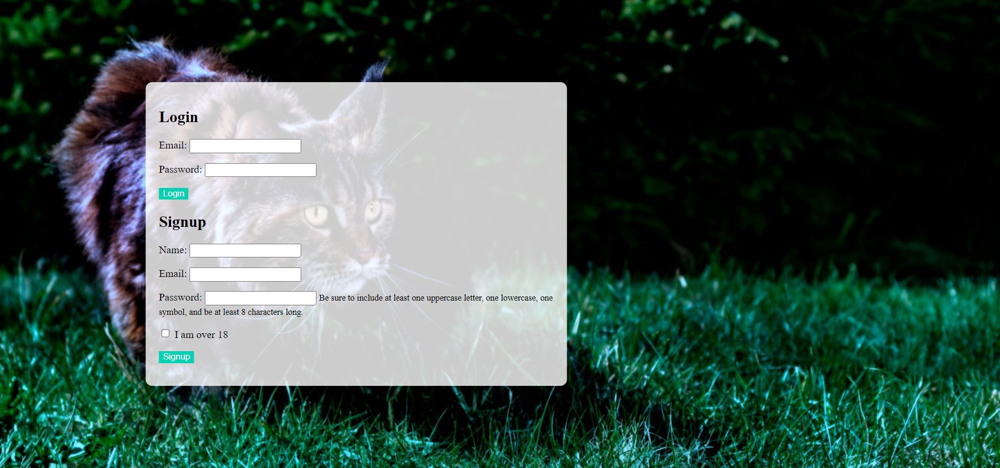
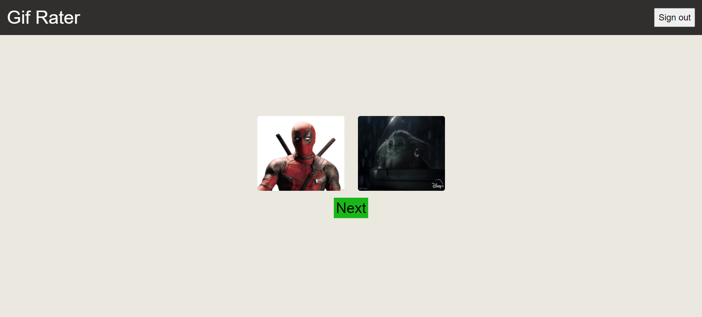

# Gif-Rater 

### Dev Team Six is happy to announce the launch of Gif-Rater!  Want some good laughs looking at some cute and funny cats?  Gif-Rater is you go to choice for some good laid back times!  Join our excited player base in rating between a pair of Gifs.  Visit the link below and let the good times roll! 

## How to use

<strong>Click link to launch Gif-Rater.</strong>

<strong>[Gif-Rater](https://gif-rater-b51u.onrender.com/)</strong>

 || Upon opening Gif-Rater you are met with our landing page.  On this landing page you will see a button close to the center of your screen with the text "The Gifs Await!" on the button.  On this landing page you will also see a welcome text and a picture of two cats on the lower half of the screen.  Click the button that states "The Gifs Await!".

 || After clicking the "The Gifs Await!" button on the landing page it will direct you to one of two places.  If you are not logged in or do not have an account set up it will direct you to the login page.  On this login page you are met with a centralized form that will allow you to either login using a user pre-setup email and password or to sign up for an account.  The login form is on the upper half of the full form container with the sign up form listed under the login towards the bottom.  If you do not have an account already set up please use the sign up form located on the lower half of the full form container.  To sign up for an account please fill in the following sections: Name, Email, Password (Password needs to have at least one uppercase letter, one lowercase letter, one symbol, and be at least 8 characters long), and an 18+ age verification checkbox.  After filling out these form fields click the button under the form field listed as Signup.  Wether you sign up or using the login form after selecting their correlated button it will direct you to the following gif-rater page.  

 || Congrats!  You have now signed in/signed up for <strong>Gif-Rater</strong> and are now ready for the endless amount of fun that is <strong>Gif-Rater</strong>.  On this Gif-Rater page you are met with a navigation bar that states the title of the game, Gif-Rater, located on the left of the navigation bar as well as a sign up button located on the right of the navigation bar.  Clicking the Gif-Rater title on the left of the navigation bar will return you back to the landing page and you will <strong>stay</strong> signed in.  In the same navigation bar located on the Gif-Rater game page is the sign out button on the right of the navigation bar.  Pressing this sign out button will sign you out of your account and return you back to the landing page.  Beneath the navigation bar on the Gif-Rater page sits a pair of gifs center of screen.  These gifs are displayed horizontal to each other on larger screen sizes and vertical on smaller/mobile devices.  Beneath the pair of gifs sits a next button that will always be center of the gif pairs without regard to screen size.  When the gif pairs are displayed on page please select between one of the two gifs.  Making a selection will raise that gif pairs score value by one.  After making your selection, a score will appear next to the gifs.  Once you have made a selection please click the next button directly underneath the gif pairs to move onto the next gif pairs.  This will repeat the selection process indefinitely until a user decides to stop playing the game.  Why would you though!?  This is hours of fun!

 || At the end of this README file will display each page as it should render and a live demo.  

## Tech used

* Bulma CSS framework
* Live Server
* Live Share
* NodeJS
* Render
* NPM
* Handlebars
* SQL 

## Spot an issue?

### We would love to hear from you, heres how:

 Please follow link: 

[GitHub](https://github.com/Massogon/gif-rater)

 Please create an issue related to any faults or concerns with <strong>Gif-Rater</strong>. 

## Contributors

### Dev Team Six

* <strong>Eduardo [GitHub](https://github.com/Massogon)</strong>
* <strong>Mason [GitHub](https://github.com/MrCows)</strong>
* <strong>Kyle [GitHub](https://github.com/KyleSunday)</strong>
* <strong>Chris [GitHub](https://github.com/xChrisxWilliamsx)</strong>
* <strong>Joey [GitHub](https://github.com/wol42verine)</strong>

### Gif-Rater should render as follows:

 
---

 
---

 
---

 